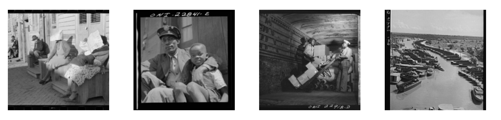

# New Deal in New Orleans - Web Scraping Images
This collection of Python scripts were written for a final project in the course Programming for Cultural Heritage taken at Pratt Institute. The collection scrapes two websites: Yale's Photogrammar and the New Orleans Public Library WPA Photography Collection. The scraped images were used to create [The New Deal in New Orleans](http://omekas.prattsi.org/s/The-New-Deal-in-New-Orleans/page/About), an Omeka site showcasing images taken during the New Deal. 

## About 

(1) Yale's Photogrammar 

Running FSA_Photo_1_JSON_Write.py creates a JSON file that includes metadata information as well as image URLs.

Running FSA_Photo_2_Download.py reads the image URLs from the JSON file created by the first script and downloads them to a local folder named FSA_Images. You will need to create this folder in your local directory before running script 2 and download. 

(2) New Orleans Public Library's WPA Collection 

 Running WPA_COLLECTION NAME_1_JSON_Write.py creates a JSON file that includes metadata information as well as image URLs. 

 Running WPA_COLLECTION_NAME_2_Download.py reads the image URLs from the JSON file created by the first script and downloads them to a local folder named WPA_COLLECTION NAME_Images. You will need to create a folder with the collection name (i.e. WPA_Lib_Images, WPA_Rec_Images) in your local directory before downloading. Please be advised that the folder name must match the file path in the second script.

 Scripts are available for the following WPA collections:
 
 - Education
 - Drainage
 - Recreation
 - Lakefront
 - Library
 - Music
 - Public Health

 If you have any questions, feel free to reach out at genevieve [dot] milliken [at] gmail [dot] com

